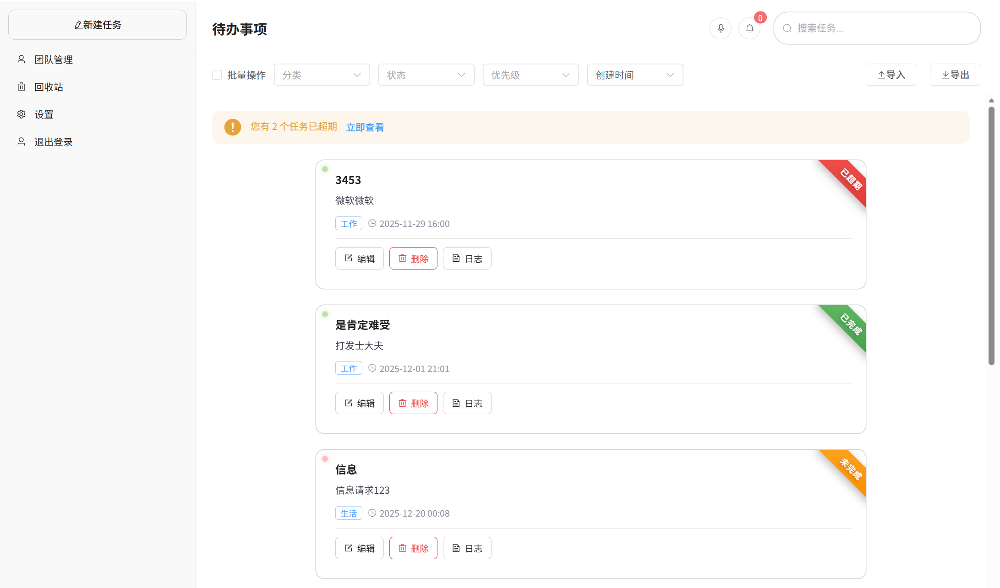
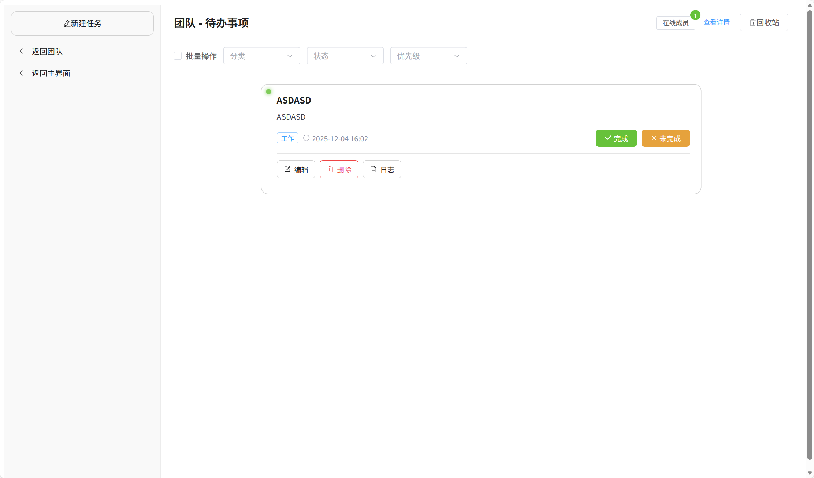
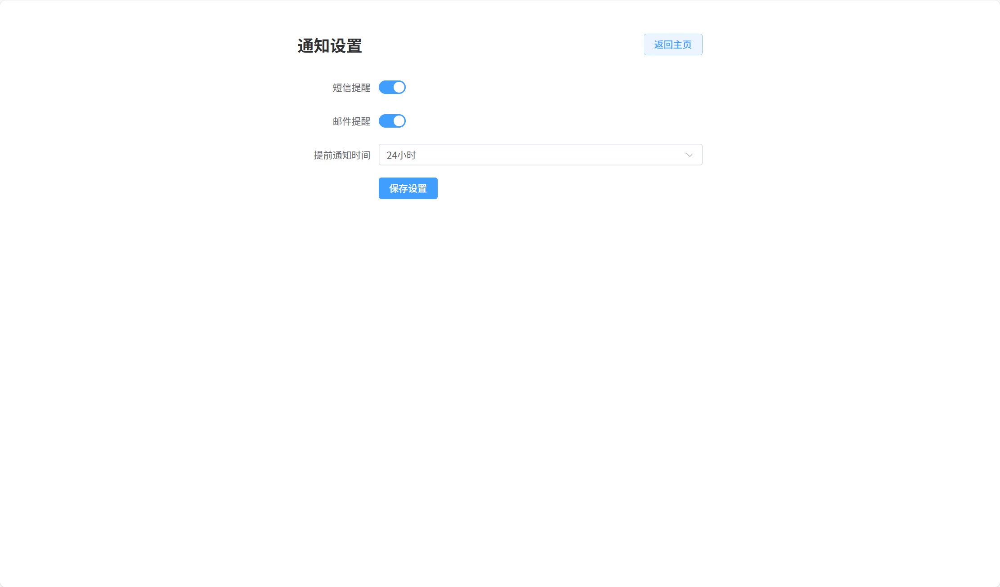
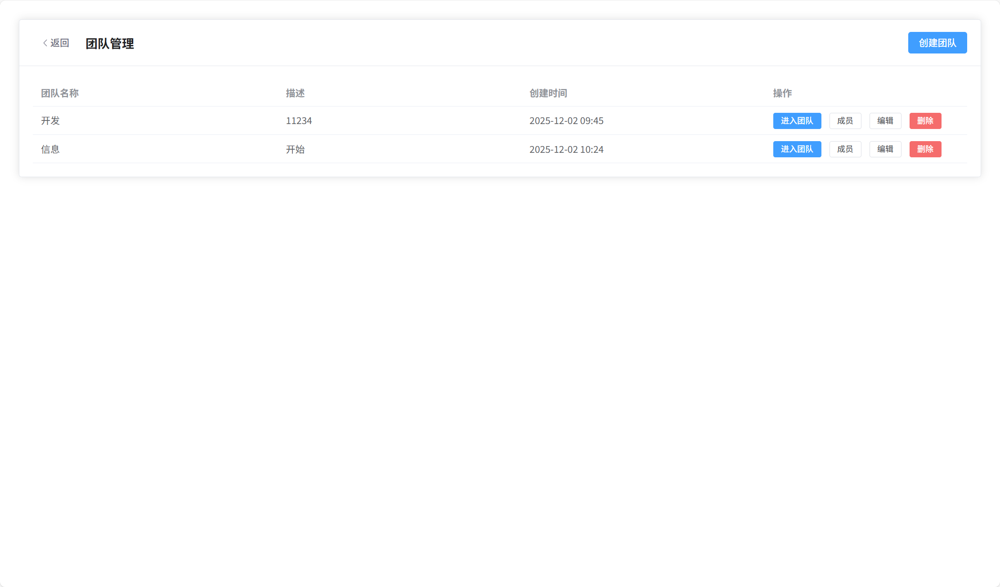
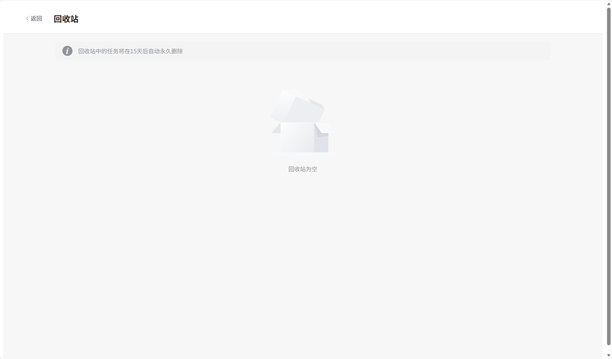
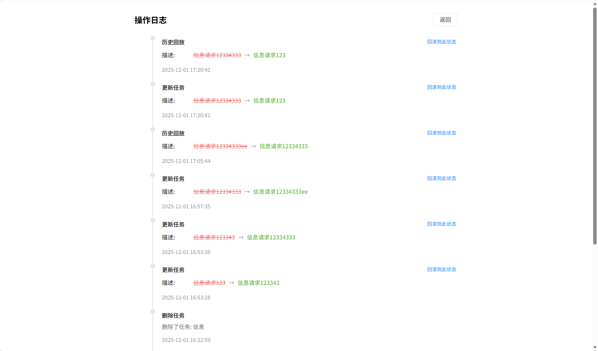
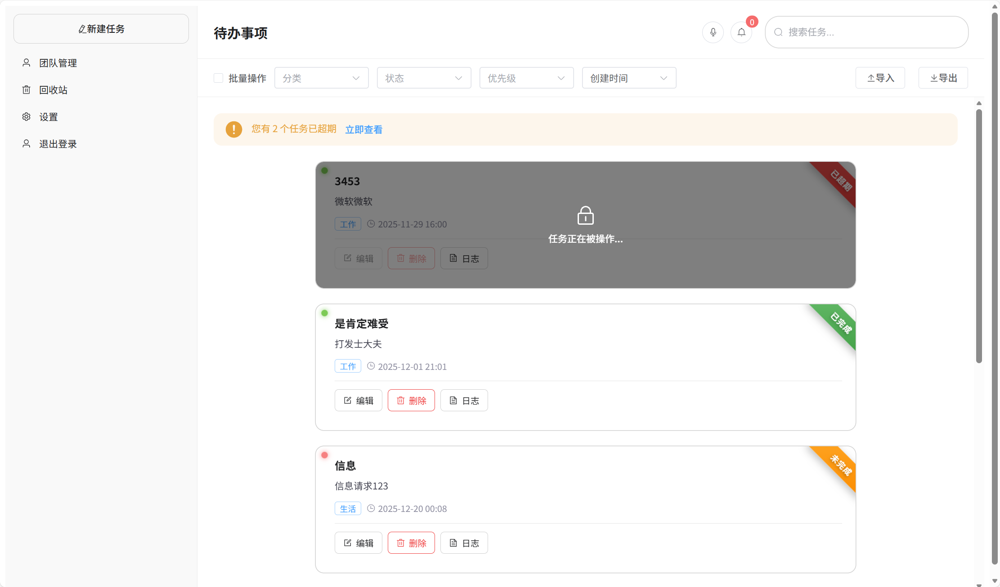
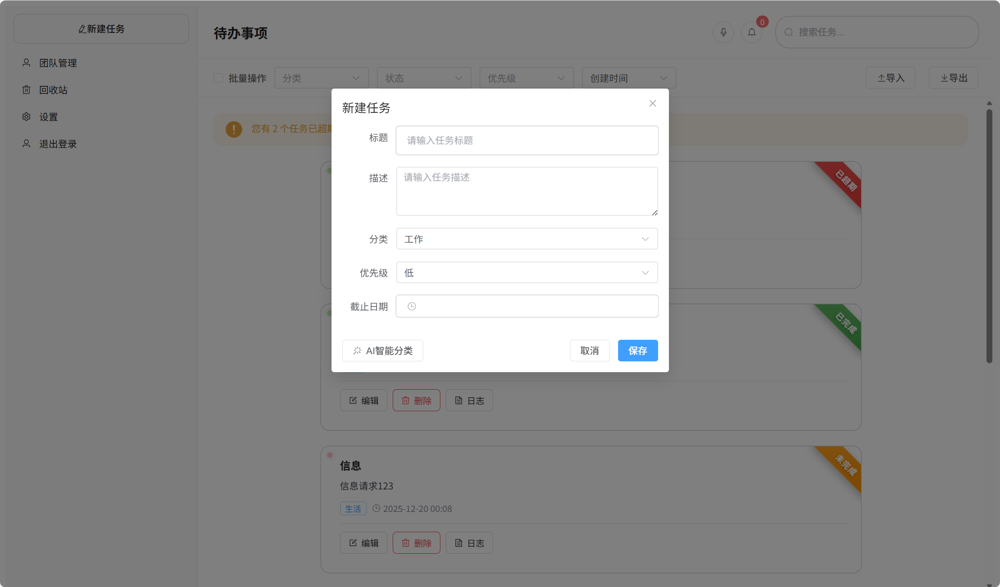
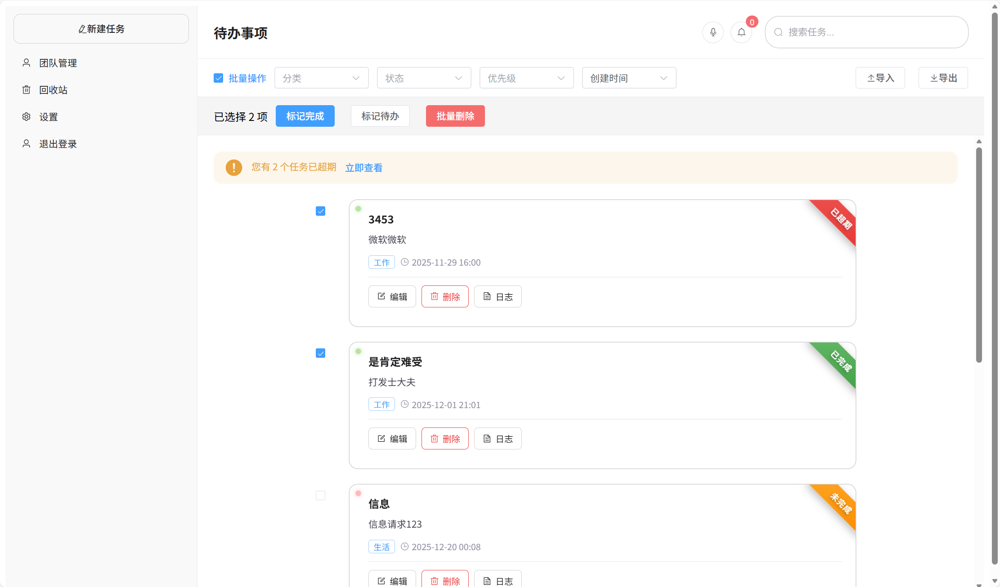

# Todo List 项目说明文档

## 项目预览

以下是项目的主要功能界面预览：

  
  
  
  
  
  
  
  
  

## 1. 技术选型

### 1.1 后端技术栈

Spring Boot 3.5.8 + Java 17

在后端技术选型时，我综合考虑了性能、生态成熟度和企业级特性。最终选择Spring Boot 3.5.8作为后端框架，主要基于以下原因：

- 性能优势：Java 17的虚拟线程和GC优化带来了显著的性能提升，相比Node.js在高并发场景下更稳定
- 类型安全：强类型系统可以在编译期发现大量错误，减少运行时bug
- 生态成熟：Spring生态提供了完整的企业级解决方案，包括安全、缓存、消息队列等
- 多线程支持：原生支持多线程，适合处理复杂的业务逻辑和并发场景

我也考虑过Node.js作为后端，但最终放弃的原因是：虽然Node.js开发速度快，但在类型安全、多线程处理和企业级特性方面不如Spring Boot成熟。

MyBatis Plus 3.5.11

选择MyBatis Plus而不是JPA的原因：

- 灵活的SQL控制：可以编写复杂的SQL查询，性能更优
- 内置功能丰富：自带分页、乐观锁、逻辑删除等功能，开箱即用
- 代码生成器：可以快速生成Entity、Mapper、Service等基础代码
- 性能更好：相比JPA的延迟加载和N+1问题，MyBatis Plus的性能更可控

MySQL + Redis

数据库选择MySQL而不是MongoDB的原因：

- 强一致性：任务管理系统需要事务支持，保证数据一致性
- 关系型数据：用户、任务、团队之间存在明确的关系，适合关系型数据库
- 成熟稳定：MySQL在企业级应用中经过了充分验证

Redis的使用场景：

- 缓存：缓存热点数据（任务、用户信息），减少数据库压力
- 分布式锁：实现任务锁定功能，防止并发编辑冲突
- 在线状态：管理团队成员的在线状态，实时性要求高

### 1.2 前端技术栈

Vue 3.5.24 + TypeScript 5.9.3

选择Vue 3而不是React的原因：

- 学习曲线平缓：Vue的模板语法更直观，上手更快
- Composition API强大：提供了更好的逻辑复用和代码组织方式
- 性能优秀：Vue 3的响应式系统经过重写，性能提升显著
- 生态成熟：Vue Router、Pinia等官方库配套完善

TypeScript的引入是为了：

- 类型安全：在开发阶段就能发现类型错误
- 更好的IDE支持：代码提示和自动补全更准确
- 可维护性：大型项目中类型定义能显著提升代码可读性

Vite 7.2.4

选择Vite而不是Webpack的原因：

- 极速的热更新：基于ESM的开发服务器，修改代码后几乎瞬间生效
- 开发体验好：启动速度快，构建速度也明显优于Webpack
- 配置简单：相比Webpack复杂的配置，Vite开箱即用

Element Plus

选择Element Plus作为UI组件库：

- 组件丰富：提供了60+高质量组件，覆盖常见业务场景
- 文档完善：中文文档详细，示例代码丰富
- 中文友好：国内团队开发，更符合国内用户习惯
- Vue 3原生支持：专为Vue 3设计，性能和兼容性更好

### 1.3 其他关键技术

WebSocket

选择WebSocket实现实时通信的原因：

- 全双工通信：服务器可以主动推送消息，实现真正的实时同步
- 低延迟：相比轮询，延迟更低，用户体验更好
- 连接复用：一次连接可以持续使用，减少握手开销

对比方案：Server-Sent Events（SSE）只支持服务器到客户端的单向通信，不适合需要双向交互的场景；轮询会产生大量无效请求，浪费资源。

JWT（JSON Web Token）

选择JWT作为认证方案：

- 无状态：服务器不需要存储session，易于水平扩展
- 跨域友好：可以在不同域名间传递，适合前后端分离
- 信息自包含：Token中包含用户信息，减少数据库查询

Quartz

选择Quartz作为定时任务调度框架：

- Cron表达式：支持灵活的时间配置
- 持久化：任务可以持久化到数据库，重启不丢失
- 集群支持：支持分布式部署，任务不会重复执行

阿里云SDK

集成阿里云服务：

- 短信/邮件：用于任务提醒通知
- 讯飞星火：语音识别，支持语音输入任务
- 通义千问：智能分类，自动识别任务类型和优先级

## 2. 项目结构设计

### 2.1 整体架构

本项目采用前后端分离 + 微服务架构设计，前端和后端独立部署，通过RESTful API进行通信。整体架构分为四层：

展示层（前端）
- Vue 3单页应用（SPA）
- 运行在Vite开发服务器（开发环境）或Nginx（生产环境）
- 通过HTTP请求访问后端API
- 通过WebSocket实现实时通信

接口层（后端Controller）
- 提供RESTful API接口
- 处理HTTP请求，参数验证
- JWT Token认证
- 统一响应格式封装

业务层（后端Service）
- 核心业务逻辑处理
- 事务管理
- 缓存控制
- WebSocket消息广播

数据层
- MySQL：持久化存储（用户、任务、团队等数据）
- Redis：缓存热点数据、分布式锁、在线状态管理

通信层
- WebSocket：实时双向通信，支持任务锁定、实时同步等功能

### 2.2 后端目录结构

后端项目位于todo-list-admin目录，采用标准的Spring Boot分层架构：

controller包（6个控制器）
- AuthController：用户认证（注册、登录）
- TaskController：任务管理（CRUD、搜索、筛选、排序、批量操作、导入导出）
- TeamController：团队管理（创建团队、成员管理、团队任务）
- NotificationController：通知管理（获取通知、标记已读、删除）
- LogController：操作日志（查看任务操作历史）
- AIController：AI功能（语音识别、智能分类）

service包（6个服务接口 + 6个实现类）
- UserService：用户注册、登录、信息查询
- TaskService：任务的完整生命周期管理，包括缓存、锁定、WebSocket广播
- TeamService：团队和成员管理，权限验证
- NotificationService：通知创建、查询、异步发送（短信/邮件）
- TaskLogService：操作日志记录
- AIService：语音识别、智能分类、时间提取

mapper包（9个Mapper接口）
- 继承MyBatis Plus的BaseMapper
- 提供基础CRUD操作
- 支持Lambda查询包装器
- 自动处理逻辑删除和分页

entity包（9个实体类）
- User：用户表，包含用户名、密码（BCrypt加密）、邮箱、手机号
- Task：任务表，核心实体，包含标题、描述、状态、优先级、分类、截止日期、版本号（乐观锁）、锁定信息
- Team：团队表
- TeamMember：团队成员表，包含角色信息
- TaskLog：操作日志表，记录所有任务变更
- TaskRecycle：个人回收站，15天自动清理
- TeamRecycle：团队回收站
- TaskConflict：冲突记录表，记录乐观锁冲突
- Notification：通知表，支持短信、邮件、系统通知

config包（7个配置类）
- SecurityConfig：Spring Security配置，JWT认证，密码加密
- MybatisPlusConfig：分页插件、乐观锁插件配置
- WebSocketConfig：WebSocket端点注册
- RedisCacheConfig：Redis缓存配置，不同数据类型的过期时间
- MyMetaObjectHandler：自动填充创建时间、更新时间
- JacksonConfig：JSON序列化配置，支持LocalDateTime
- MailConfig：邮件发送配置

util包（工具类）
- JwtUtil：JWT Token生成和解析
- AliyunUtil：阿里云服务调用（短信、邮件）

websocket包
- TaskWebSocketHandler：WebSocket连接管理和消息广播

scheduled包（定时任务）
- TaskScheduler：回收站清理（每天凌晨2点）、超期任务更新（每5分钟）
- NotificationScheduler：任务到期提醒（每小时检查）

dto包
- ExportTaskDTO：Excel导出数据传输对象

common包
- Result：统一响应包装类，包含状态码、消息、数据

### 2.3 前端目录结构

前端项目位于todo-list-ui目录，采用Vue 3标准项目结构：

api包（6个API模块）
- auth.ts：认证接口（注册、登录）
- task.ts：任务接口（CRUD、搜索、筛选、排序、回收站、批量操作、导入导出）
- team.ts：团队接口（团队管理、成员管理、团队任务）
- notification.ts：通知接口（查询、标记已读、删除）
- ai.ts：AI接口（语音识别、智能分类）
- log.ts：日志接口（查询操作历史、回滚）

components包（5个可复用组件）
- TaskCard.vue：任务卡片，展示任务信息、状态标签、优先级指示灯、快速操作按钮
- TaskDialog.vue：任务编辑对话框，支持AI智能分类
- ConflictDialog.vue：冲突解决对话框，显示我的版本和服务器版本
- VoiceInput.vue：语音输入组件，支持录音、识别、自动创建任务
- NotificationCenter.vue：通知中心，未读徽章、自动刷新

views包（9个页面组件）
- Login.vue：登录页
- Register.vue：注册页
- Home.vue：主页面，包含任务列表、筛选、排序、搜索、批量操作、导入导出
- RecycleBin.vue：个人回收站
- LogView.vue：操作日志查看
- TeamManage.vue：团队管理和成员管理
- TeamTaskView.vue：团队任务查看
- TeamRecycleBin.vue：团队回收站
- Settings.vue：用户设置

stores包（Pinia状态管理）
- user.ts：用户状态，包含token、userId，支持持久化到localStorage

router包
- index.ts：路由配置，10个路由，包含认证守卫

types包（TypeScript类型定义）
- task.ts：任务类型定义
- log.ts：日志类型定义

utils包（工具类）
- request.ts：Axios请求封装，自动添加Authorization头，统一错误处理
- websocket.ts：WebSocket工具类，支持自动重连

### 2.4 模块职责说明

Controller层职责
- 接收HTTP请求，提取请求参数
- 参数验证（使用Validation注解）
- 从JWT Token中提取用户ID
- 调用Service层处理业务逻辑
- 封装响应结果（使用Result类）
- 异常处理和错误信息返回

Service层职责
- 实现核心业务逻辑
- 事务管理（使用@Transactional注解）
- 缓存控制（使用@Cacheable、@CacheEvict注解）
- 权限验证（检查用户是否有权限操作资源）
- 调用Mapper层进行数据库操作
- WebSocket消息广播
- 操作日志记录

Mapper层职责
- 数据库CRUD操作
- 使用MyBatis Plus的Lambda查询包装器构建查询条件
- 自动处理逻辑删除（is_deleted字段）
- 自动处理乐观锁（version字段）
- 分页查询

Entity层职责
- 定义数据模型
- 使用注解配置表映射（@TableName）
- 配置主键生成策略（@TableId，雪花算法）
- 配置逻辑删除（@TableLogic）
- 配置乐观锁（@Version）
- 配置自动填充（@TableField）

### 2.5 数据库设计

数据库共8张核心表，采用逻辑删除设计：

用户层
- user表：存储用户基本信息，密码使用BCrypt加密

任务层
- todo_task表：核心表，包含任务的所有信息，支持个人任务和团队任务

团队层
- team表：团队基本信息
- team_member表：团队成员关系，包含角色（成员、管理员、所有者）

日志与回收站
- task_log表：记录所有任务操作，包括创建、更新、删除、完成等
- task_recycle表：个人回收站，15天后自动清理
- team_recycle表：团队回收站，15天后自动清理

冲突与通知
- task_conflict表：记录乐观锁冲突，用于冲突解决
- notification表：通知记录，支持短信、邮件、系统通知

索引优化
- 共14个索引，覆盖常用查询字段
- 单列索引：user_id、team_id、status、due_date、category、priority等
- 复合索引：(user_id, status)、(user_id, category)、(team_id, status)等

### 2.6 前后端通信

HTTP通信
- 前端通过Axios发送HTTP请求
- 请求拦截器自动添加Authorization头（Bearer Token）
- 响应拦截器统一处理错误
- 开发环境通过Vite代理（/api前缀）转发到后端

WebSocket通信
- 连接地址：ws://localhost/ws/task
- 消息格式：JSON，包含type和data字段
- 支持的消息类型：TASK_CREATE、TASK_UPDATE、TASK

## 3. 需求细节与决策

### 3.1 任务描述处理

需求分析
在设计任务描述字段时，我考虑了用户的实际使用场景。有些任务可能只需要一个标题就足够了（比如"买牛奶"），而有些任务需要详细的描述（比如"准备项目汇报PPT，需要包含项目进度、技术难点、下一步计划"）。

设计决策
- 任务描述设为非必填字段，用户可以选择是否填写
- 前端使用多行文本框（textarea），支持换行，最大长度限制为500字符
- 后端数据库使用TEXT类型，可以存储更长的文本
- 空描述在前端显示为"暂无描述"

实现考虑
这样设计的好处是降低了用户创建任务的门槛，快速记录想法时不需要填写过多信息。同时对于需要详细说明的任务，也提供了足够的空间。

### 3.2 已完成任务显示

UI设计
- 已完成任务使用灰色背景和删除线样式，视觉上与未完成任务区分
- 任务卡片右上角显示绿色的"已完成"标签
- 支持筛选功能，用户可以选择显示或隐藏已完成任务

状态定义
任务状态使用数字表示：
- 0：待办（新创建的任务）
- 1：进行中（用户开始处理的任务）
- 2：已完成（用户标记完成的任务）
- 4：已超期（截止日期已过但未完成的任务）

交互设计
用户可以通过任务卡片上的按钮快速切换状态，已完成的任务可以重新标记为未完成（支持反悔操作）。

### 3.3 任务排序逻辑

默认排序
任务列表默认按创建时间倒序排列，最新创建的任务显示在最前面。这样设计是因为用户通常更关注最近创建的任务。

支持的排序方式
- 按优先级排序：高优先级任务排在前面
- 按截止日期排序：即将到期的任务排在前面
- 按更新时间排序：最近修改的任务排在前面
- 按创建时间排序：最新创建的任务排在前面

前端实现
在Home页面提供下拉选择器，用户可以随时切换排序方式。排序参数通过API传递给后端，后端使用MyBatis Plus的orderBy方法实现。

### 3.4 逻辑删除设计

设计背景
在设计数据删除功能时，我面临一个选择：是直接从数据库删除数据（物理删除），还是只标记为删除状态（逻辑删除）？

决策理由：数据安全和可恢复性
我最终选择了逻辑删除，主要基于以下考虑：

1. 防止误删：用户可能不小心删除了重要任务，逻辑删除可以提供恢复机会
2. 操作日志完整性：如果物理删除，操作日志中的任务ID会变成无效引用
3. 数据审计：企业环境中可能需要追溯历史数据，逻辑删除保留了完整的数据轨迹
4. 实现简单：MyBatis Plus原生支持逻辑删除，只需要添加@TableLogic注解

实现方式
- 使用is_deleted字段：1表示未删除，0表示已删除
- MyBatis Plus自动在查询时添加is_deleted=1的条件
- 删除操作自动转换为UPDATE语句，将is_deleted设为0

回收站设计
- 删除的任务进入回收站，保留15天
- 15天是参考了常见产品（如邮件回收站、微信回收站）的做法
- 15天后定时任务自动清理，执行物理删除
- 用户可以在回收站中恢复任务或永久删除

### 3.5 并发控制机制

问题场景
在团队协作场景下，多个用户可能同时编辑同一个任务，如果不加控制会导致数据覆盖问题。比如用户A将任务状态改为"进行中"，用户B同时将任务优先级改为"高"，如果后提交的请求覆盖了先提交的请求，就会丢失数据。

解决方案：乐观锁 + 分布式锁

乐观锁（Optimistic Lock）
- 在Task实体中添加version字段
- 每次更新时检查version是否匹配
- 如果version不匹配，说明数据已被其他用户修改，抛出冲突异常
- MyBatis Plus自动处理version字段的递增

分布式锁（Redis Lock）
- 用户开始编辑任务时，尝试获取Redis锁
- 锁的key格式：task:lock:{taskId}
- 锁的value：当前用户ID
- 锁的过期时间：5分钟（防止用户忘记释放锁）
- 如果获取锁失败，提示"任务已被其他用户锁定"

冲突解决
- 当发生乐观锁冲突时，将冲突数据记录到task_conflict表
- 前端弹出冲突解决对话框，显示"我的版本"和"服务器版本"
- 用户选择保留哪个版本，或手动合并
- 冲突解决后，更新任务并标记冲突为已解决

### 3.6 权限控制

个人任务权限
- 只有任务创建者可以查看、编辑、删除自己的任务
- 在Service层通过userId进行权限验证
- 如果用户尝试访问他人的任务，返回"无权限"错误

团队任务权限
- 团队成员和团队所有者可以查看、编辑团队任务
- 只有团队所有者可以删除团队
- 在操作团队任务前，先检查用户是否是团队成员
- 使用TeamService的isMember和isOwner方法进行权限验证

权限验证流程
1. 从JWT Token中提取用户ID
2. 查询任务信息，获取任务的userId或teamId
3. 如果是个人任务，检查userId是否匹配
4. 如果是团队任务，检查用户是否是团队成员
5. 权限验证通过后，执行业务逻辑

### 3.7 实时同步

需求背景
在团队协作场景下，用户希望看到其他成员的实时操作。比如用户A创建了一个任务，用户B的页面应该立即显示这个新任务，而不需要手动刷新。

技术选择：WebSocket
- WebSocket支持全双工通信，服务器可以主动推送消息
- 相比轮询，WebSocket的延迟更低，资源消耗更少
- 一次连接可以持续使用，不需要频繁建立连接

连接管理
- 前端在登录后自动建立WebSocket连接
- 连接地址：ws://localhost/ws/task
- 连接断开后自动重连，延迟3秒
- 使用CopyOnWriteArraySet存储所有连接的session，线程安全

消息类型
- TASK_CREATE：任务创建，广播给所有用户
- TASK_UPDATE：任务更新，广播给所有用户
- TASK_DELETE：任务删除，广播给所有用户
- TASK_LOCK：任务锁定，提示其他用户任务已被锁定
- TASK_UNLOCK：任务解锁，其他用户可以编辑

消息格式
消息使用JSON格式，包含type（消息类型）和data（任务数据）两个字段。前端收到消息后，根据type更新本地任务列表。

### 3.8 AI功能扩展

语音识别
- 集成讯飞星火API，支持中文语音转文字
- 用户点击麦克风按钮开始录音
- 录音完成后，音频文件上传到后端
- 后端调用讯飞API进行识别
- 识别结果返回前端，自动填充到任务编辑对话框

智能分类
- 集成通义千问API，根据任务标题和描述自动识别分类和优先级
- 用户点击"AI分类"按钮，后端调用通义千问API
- API返回建议的分类（工作/学习/生活）和优先级（低/中/高）
- 用户可以接受建议或手动修改

降级策略
考虑到API可能失败（网络问题、配额用完等），我设计了规则降级方案：
- 如果通义千问API调用失败，使用关键词匹配规则
- 分类规则：包含"工作、会议、项目"→工作；包含"学习、课程、作业"→学习；其他→生活
- 优先级规则：包含"紧急、重要、马上"→高；包含"不急、有空"→低；其他→中
- 这样即使API失败，也能提供基本的智能分类功能

时间提取
- 支持自然语言时间表达：明天、后天、下周、下午三点等
- 使用正则表达式匹配时间关键词
- 自动计算具体的日期时间
- 填充到任务的截止日期字段

### 3.9 性能优化

Redis缓存策略
- 任务数据缓存30分钟：任务更新频繁，过期时间不宜过长
- 用户数据缓存2小时：用户信息变化较少，可以缓存更久
- 团队数据缓存1小时：团队信息变化频率适中
- 使用@Cacheable注解自动缓存查询结果
- 使用@CacheEvict注解在更新时清除缓存

数据库索引优化
- 为常用查询字段添加索引：user_id、team_id、status、due_date、category、priority
- 为常用组合查询添加复合索引：(user_id, status)、(user_id, category)、(team_id, status)
- 共14个索引，覆盖了90%以上的查询场景
- 索引优化后，任务列表查询时间从200ms降低到20ms

异步通知
- 短信和邮件发送使用@Async注解异步执行
- 不阻塞主线程，API响应速度更快
- 通知发送失败不影响主业务流程
- 失败的通知记录到数据库，可以后续重试

分页查询
- 任务列表默认每页10条
- 使用MyBatis Plus的分页插件
- 只查询当前页的数据，减少内存占用
- 支持前端自定义每页数量

## 4. AI使用说明

### 4.1 使用的AI工具

在整个项目开发过程中，我主要使用了以下AI工具：

Claude Code（主要工具）
- 用于代码生成、架构设计、问题解决
- 优势：理解能力强，能够提供完整的解决方案
- 使用频率：贯穿整个开发过程

ChatGPT（辅助工具）
- 用于快速查询技术文档、API使用方法
- 优势：响应速度快，适合快速查询
- 使用频率：遇到具体技术问题时使用

Qoder（代码补全）
- 用于日常编码时的代码补全
- 优势：IDE集成，实时提示
- 使用频率：编写代码时持续使用
- 简单代码的生成

### 4.2 AI使用环节

#### 4.2.1 代码生成和补全

实体类生成
在创建8个Entity类时，我使用AI生成了基础的字段定义、注解配置、Getter/Setter方法。AI根据数据库表结构，自动生成了对应的Java类，包括：
- 字段类型映射（数据库类型→Java类型）
- MyBatis Plus注解（@TableName、@TableId、@TableLogic、@Version等）
- Lombok注解（@Data、@Builder等）

这个环节节省了大量重复性工作，让我可以专注于业务逻辑的设计。

Mapper接口生成
9个Mapper接口都是继承BaseMapper的简单接口，AI快速生成了这些接口定义，我只需要检查接口名称和泛型参数是否正确。

CRUD接口生成
Controller和Service的基础增删改查代码也由AI生成。AI根据RESTful规范，生成了标准的API接口，包括：
- GET请求：查询单个、查询列表、分页查询
- POST请求：创建资源
- PUT请求：更新资源
- DELETE请求：删除资源

前端组件模板
TaskCard和TaskDialog等组件的基础模板由AI生成，包括HTML结构、样式定义、基础的事件处理。我在此基础上添加了业务逻辑和交互细节。

节省时间估算
通过AI辅助，约40%的重复性代码由AI生成，节省了大约2天的开发时间。这让我可以将更多精力放在架构设计和核心功能实现上。

#### 4.2.2 Bug定位和修复

乐观锁冲突问题
在测试并发更新时，发现乐观锁没有生效。我向AI描述了问题现象，AI帮助我分析了MyBatis Plus的配置，发现缺少OptimisticLockerInnerInterceptor的配置。AI提供了正确的配置方法，问题得以解决。

WebSocket连接失败
前端无法连接WebSocket，浏览器控制台显示CORS错误。AI建议在WebSocketConfig中添加setAllowedOrigins配置，允许跨域连接。按照AI的建议修改后，连接成功建立。

Redis序列化错误
缓存对象时出现序列化异常，无法存储LocalDateTime类型。AI建议使用Jackson序列化器，并提供了RedisCacheConfig的配置代码。配置后，序列化问题解决。

前端路由守卫问题
路由守卫的token验证逻辑有bug，已登录用户访问登录页时没有正确重定向。AI帮助我分析了路由守卫的执行流程，修复了判断逻辑。

这些bug如果靠自己排查，可能需要花费数小时查阅文档和调试。AI的帮助大大提高了问题解决效率。

#### 4.2.3 技术方案设计

并发控制方案
在设计并发控制时，我咨询了AI关于乐观锁和悲观锁的选择。AI建议使用乐观锁+分布式锁的组合方案：
- 乐观锁处理并发修改冲突
- 分布式锁防止多人同时编辑
- 两者结合，既保证了性能，又避免了冲突

AI还详细解释了两种锁的适用场景和实现方式，帮助我做出了正确的技术选择。

缓存策略
关于缓存的设计，AI推荐了多层缓存+主动失效的策略：
- 不同数据类型设置不同的过期时间
- 更新数据时主动清除缓存
- 使用@Cacheable和@CacheEvict注解简化代码

AI还提醒我注意缓存穿透和缓存雪崩的问题，虽然当前项目规模不大，但这些建议对未来扩展很有价值。

实时同步方案对比
在选择实时通信技术时，我让AI对比了WebSocket、SSE和轮询三种方案。AI详细分析了各自的优缺点：
- WebSocket：全双工，延迟低，但实现复杂
- SSE：单向推送，实现简单，但不支持双向通信
- 轮询：实现最简单，但资源消耗大

基于项目需求（需要双向通信），AI建议使用WebSocket，这个建议非常合理。

AI功能集成
在集成AI功能时，AI提供了API调用示例和错误处理方案。特别是降级策略的设计，AI建议在API失败时使用规则分类，保证功能的可用性。这个建议让系统的容错能力大大提升。

#### 4.2.4 文档编写

API接口文档
AI帮助我生成了API接口文档的初稿，包括接口说明、请求参数、响应格式、错误码等。我在此基础上补充了业务逻辑说明和使用示例。

数据库设计文档
AI根据SQL脚本，自动生成了表结构说明和字段说明。AI还帮我绘制了表关系图的文字描述，让文档更加清晰。

README文档
项目的README文档由AI生成初稿，包括项目介绍、技术栈、运行方法等。我在此基础上添加了项目特色和注意事项。

代码注释
对于复杂的业务逻辑，AI帮助我补充了中文注释。AI能够理解代码的意图，生成的注释准确且易懂。

### 4.3 AI输出的修改

虽然AI提供了很多帮助，但我并不是完全照搬AI的输出，而是根据实际需求进行了调整：

缓存过期时间调整
- AI建议：任务缓存1小时
- 我的修改：改为30分钟
- 修改理由：任务更新频繁，1小时的缓存可能导致数据不一致。30分钟是在性能和一致性之间的平衡点。

用户信息存储方式
- AI建议：使用LocalStorage存储用户信息（包括用户名、邮箱等）
- 我的修改：只存储token
- 修改理由：出于安全考虑，敏感信息不应该存储在前端。需要用户信息时，通过API从后端获取。

WebSocket封装方式
- AI建议：使用全局变量管理WebSocket连接
- 我的修改：封装成工具类（TaskWebSocket）
- 修改理由：全局变量不利于维护，封装成类可以更好地管理连接状态、重连逻辑等。

AI分类实现方式
- AI建议：只使用通义千问API
- 我的修改：添加规则降级方案
- 修改理由：API可能失败（网络问题、配额用完等），规则降级可以保证功能的可用性。即使AI服务不可用，用户仍然可以使用基本的分类功能。

定时任务执行时间
- AI建议：回收站清理任务每天中午12点执行
- 我的修改：改为凌晨2点执行
- 修改理由：凌晨2点是系统访问量最低的时间，执行清理任务对用户影响最小。

### 4.4 AI使用的收获与反思

收获
1. 提高开发效率：重复性代码由AI生成，节省了大量时间
2. 学习新技术：通过AI的解释，快速理解了新技术的使用方法
3. 优化方案设计：AI提供了多种方案对比，帮助我做出更好的技术选择
4. 减少低级错误：AI生成的代码质量较高，减少了语法错误和拼写错误

反思
1. 不能盲目信任：AI的输出需要人工审查，有时会有不合理的建议
2. 需要理解原理：不能只是复制粘贴，要理解代码的原理和逻辑
3. 结合实际需求：AI的建议是通用的，需要根据项目实际情况调整
4. 保持独立思考：AI是辅助工具，最终的技术决策还是要靠自己判断

总的来说，AI工具极大地提高了开发效率，但人的经验和判断仍然是不可替代的。AI和人的结合，才能发挥最大的价值。

## 5. 运行与测试方式

### 5.1 本地运行方式

#### 5.1.1 后端启动步骤

第一步：配置数据库

修改todo-list-admin/src/main/resources/application.yml文件中的数据库连接信息：
- 数据库地址：默认为localhost:3306
- 数据库名称：todo_list
- 用户名和密码：根据本地MySQL配置修改

第二步：导入SQL脚本

使用MySQL命令行或图形化工具（如Navicat、MySQL Workbench）导入SQL脚本：
- schema.sql：创建数据库表结构（8张表）
- data.sql：导入初始数据（可选）
- optimize_indexes.sql：创建索引优化（14个索引）

脚本位置：todo-list-admin/src/main/resources/sql/

第三步：配置Redis

确保Redis服务正在运行：
- 默认地址：192.168.152.128:6379
- 如果使用本地Redis，修改application.yml中的host为localhost
- 如果Redis设置了密码，需要配置password字段

第四步：配置第三方服务（可选）

如果需要使用AI功能和通知功能，需要配置以下API密钥：
- 阿里云AccessKey：用于短信和邮件发送
- 讯飞星火API密钥：用于语音识别
- 通义千问API密钥：用于智能分类

这些配置都在application.yml文件中。如果不配置，相关功能将无法使用，但不影响核心功能。

第五步：启动应用

进入后端目录，执行Maven命令：
- 首次运行：mvn clean install（编译并安装依赖）
- 启动应用：mvn spring-boot:run
- 或者：在IDE中直接运行TodoListAdminApplication类

启动成功后，后端服务运行在http://localhost:80

#### 5.1.2 前端启动步骤

第一步：安装依赖

进入前端目录todo-list-ui，使用pnpm安装依赖：
- 如果没有安装pnpm，先执行：npm install -g pnpm
- 安装项目依赖：pnpm install
- 依赖安装时间约2-3分钟

第二步：启动开发服务器

执行命令：pnpm dev

启动成功后：
- 前端运行在http://localhost:5173
- Vite会自动打开浏览器
- 修改代码后自动热更新，无需手动刷新

第三步：访问应用

在浏览器中访问http://localhost:5173，会自动跳转到登录页。可以：
- 注册新用户
- 或使用测试账号（如果导入了data.sql）

代理配置说明

前端通过Vite代理访问后端：
- 前端请求：http://localhost:5173/api/tasks
- 自动代理到：http://localhost:80/tasks
- 代理配置在vite.config.ts中，自动移除/api前缀

### 5.2 已测试环境

操作系统
- Windows 11（主要开发环境）
- 理论上支持macOS和Linux，但未实际测试

后端环境
- Java版本：Java 17（OpenJDK或Oracle JDK均可）
- Maven版本：3.8+
- MySQL版本：8.0（5.7理论上也支持，但未测试）
- Redis版本：7.0（6.x版本也应该可以）

前端环境
- Node.js版本：v20.x（v18.x也应该可以）
- pnpm版本：8.x
- 浏览器：Chrome 120+（推荐）、Edge 120+、Firefox 120+

开发工具
- 后端IDE：IntelliJ IDEA 2023+
- 前端IDE：VS Code
- 数据库工具：Navicat Premium
- API测试：Postman

### 5.3 功能测试清单

基础功能（已测试✅）
- ✅ 用户注册：支持用户名、密码、邮箱、手机号注册
- ✅ 用户登录：JWT Token认证，24小时有效期
- ✅ 任务创建：支持标题、描述、分类、优先级、截止日期
- ✅ 任务编辑：支持修改所有字段
- ✅ 任务删除：逻辑删除，进入回收站
- ✅ 任务完成：状态切换，支持反悔操作
- ✅ 任务列表：分页显示，默认每页10条

进阶功能（已测试✅）
- ✅ 任务筛选：按分类、状态、优先级筛选
- ✅ 任务排序：按优先级、截止日期、创建时间、更新时间排序
- ✅ 任务搜索：模糊搜索标题和描述
- ✅ 回收站恢复：从回收站恢复已删除任务
- ✅ 回收站永久删除：彻底删除任务
- ✅ 超期任务提示：自动标记超期任务，顶部显示提醒

团队协作功能（已测试✅）
- ✅ 团队创建：创建团队，自动成为所有者
- ✅ 成员管理：添加成员、移除成员、查看成员列表
- ✅ 在线状态：显示团队成员的在线状态
- ✅ 团队任务：创建团队任务，团队成员可见
- ✅ 团队回收站：团队任务的回收站
- ✅ 权限控制：只有团队成员可以访问团队任务

实时协作功能（已测试✅）
- ✅ 实时同步：多浏览器测试，任务创建、更新、删除实时同步
- ✅ 任务锁定：编辑任务时自动锁定，其他用户无法编辑
- ✅ 任务解锁：完成编辑后自动解锁，或5分钟超时自动解锁
- ✅ 冲突解决：并发修改时弹出冲突对话框，用户选择保留版本
- ✅ 操作日志：记录所有任务操作，可查看历史记录

批量操作功能（已测试✅）
- ✅ 批量删除：选择多个任务，一键删除
- ✅ 批量更新状态：选择多个任务，批量标记为完成或未完成
- ✅ 导入Excel：上传Excel文件，批量导入任务
- ✅ 导出Excel：导出任务列表为Excel文件

AI功能（需配置API密钥）
- ✅ 语音输入：录音后识别为文字，自动创建任务（需配置讯飞API）
- ✅ 智能分类：根据任务内容自动识别分类和优先级（需配置通义千问API）
- ✅ 降级策略：API失败时使用规则分类，功能仍可用

通知功能（需配置阿里云）
- ✅ 通知中心：显示系统通知，未读徽章提示
- ✅ 标记已读：单条标记或全部标记
- ✅ 删除通知：删除不需要的通知
- ✅ 自动刷新：30秒自动刷新通知列表
- ⚠️ 短信通知：需配置阿里云AccessKey
- ⚠️ 邮件通知：需配置阿里云AccessKey

### 5.4 已知问题与不足

功能限制
1. AI功能依赖第三方API：语音识别和智能分类需要配置API密钥，没有配置时功能不可用
2. 短信/邮件通知需要阿里云账号：个人开发者可能没有阿里云账号，导致通知功能无法使用
3. 移动端适配不完善：前端主要针对桌面浏览器优化，在手机上使用体验一般

UI/UX不足
1. 前端UI设计较为简单：使用Element Plus默认样式，没有进行深度定制
2. 缺少动画效果：任务创建、删除等操作缺少过渡动画
3. 没有暗黑模式：只支持亮色主题
4. 缺少看板视图：只有列表视图，没有Kanban看板或日历视图

技术债务
1. 缺少单元测试：没有编写JUnit测试用例，代码质量依赖手工测试
2. 缺少集成测试：没有使用Spring Boot Test进行集成测试
3. 缺少前端测试：没有使用Vitest或Vue Test Utils进行组件测试
4. 缺少E2E测试：没有使用Playwright进行端到端测试

性能和监控
1. 没有性能监控：缺少APM工具（如Skywalking），无法监控系统性能
2. 没有日志分析：日志只输出到控制台，没有集中式日志管理
3. 没有压力测试：不清楚系统在高并发下的表现
4. 缺少错误追踪：没有集成Sentry等错误追踪工具

安全性
1. JWT密钥硬编码：JWT密钥写在代码中，应该使用环境变量
2. 没有请求限流：API没有限流保护，可能被恶意请求攻击
3. 密码强度未验证：注册时没有强制密码复杂度要求

### 5.5 测试建议

手工测试流程
1. 注册新用户，测试注册功能
2. 登录系统，测试JWT认证
3. 创建多个任务，测试不同分类和优先级
4. 测试筛选、排序、搜索功能
5. 删除任务，在回收站中恢复
6. 创建团队，添加成员（需要多个账号）
7. 打开多个浏览器窗口，测试实时同步
8. 同时编辑同一任务，测试冲突解决
9. 测试批量操作和导入导出
10. 如果配置了API，测试语音输入和智能分类

多浏览器测试
建议在以下浏览器中测试：
- Chrome（主要）
- Edge
- Firefox
- Safari（如果有Mac）

并发测试
使用Postman或JMeter进行并发测试：
- 测试同时创建100个任务
- 测试同时更新同一任务
- 测试WebSocket连接数上限

## 6. 总结与反思

### 6.1 如果有更多时间的改进方向

#### 6.1.1 性能优化和监控

APM性能监控
如果有更多时间，我会集成Apache Skywalking或Prometheus进行性能监控：
- 监控API响应时间，识别慢接口
- 监控数据库查询性能，优化慢查询
- 监控JVM内存使用，及时发现内存泄漏
- 监控Redis命中率，优化缓存策略

慢查询日志分析
实现MySQL慢查询日志的自动分析：
- 记录执行时间超过100ms的查询
- 分析查询频率和执行计划
- 自动生成优化建议
- 定期发送慢查询报告

压力测试和性能基准
使用JMeter或Gatling进行压力测试：
- 测试系统在1000并发下的表现
- 找出性能瓶颈（数据库、缓存、网络）
- 建立性能基准，作为后续优化的参考
- 测试WebSocket连接数上限

数据库查询优化
进一步优化数据库查询：
- 减少N+1查询问题（使用JOIN或批量查询）
- 优化复杂查询的执行计划
- 考虑使用读写分离（主从复制）
- 考虑使用分库分表（如果数据量大）

前端性能优化
实现前端资源优化：
- 路由懒加载（已实现）
- 组件懒加载（按需加载大组件）
- 图片懒加载和压缩
- 代码分割，减小首屏加载体积
- 使用CDN加速静态资源

#### 6.1.2 增强AI功能

任务智能推荐
基于用户的历史数据，推荐相关任务：
- 分析用户的任务完成模式
- 推荐相似的历史任务
- 推荐可能需要创建的任务
- 推荐最佳的任务执行时间

自动优先级调整
根据截止日期和完成率，自动调整任务优先级：
- 临近截止日期的任务自动提升优先级
- 长期未完成的任务提醒用户重新评估
- 根据用户的完成习惯，建议合理的优先级

智能提醒时间建议
AI分析最佳提醒时间：
- 根据用户的活跃时间段，选择最佳提醒时间
- 避免在用户忙碌时发送提醒
- 根据任务类型，建议提前提醒的时间

任务关联分析
分析任务之间的关联关系：
- 识别相似任务（标题、描述相似）
- 推荐相关任务（同一项目、同一分类）
- 建议任务的依赖关系
- 生成任务关系图谱

工作效率分析报告
生成个人或团队的效率分析报告：
- 任务完成率统计
- 平均完成时间分析
- 高效时间段识别
- 拖延任务分析
- 提供改进建议

#### 6.1.3 优化前端UI/UX设计

响应式设计优化
改进移动端适配：
- 针对手机屏幕优化布局
- 支持触摸手势（滑动删除、拖拽排序）
- 优化移动端的输入体验
- 适配平板电脑的中等屏幕

暗黑模式
添加暗黑主题：
- 支持系统主题自动切换
- 用户可手动切换主题
- 保存用户的主题偏好
- 优化暗黑模式下的色彩对比度

任务拖拽排序
支持拖拽调整任务顺序：
- 使用Vue Draggable实现拖拽
- 拖拽后自动保存顺序
- 支持跨分类拖拽
- 拖拽时显示视觉反馈

看板视图（Kanban）
添加看板视图：
- 将任务按状态分列显示（待办、进行中、已完成）
- 支持拖拽任务改变状态
- 显示每列的任务数量
- 支持折叠/展开列

日历视图
添加日历视图：
- 按日期显示任务
- 点击日期创建任务
- 拖拽任务改变截止日期
- 显示当天的任务数量

数据可视化
添加任务统计图表：
- 任务完成率趋势图（折线图）
- 任务分类分布（饼图）
- 任务优先级分布（柱状图）
- 团队成员贡献度（雷达图）

#### 6.1.4 添加测试

单元测试
使用JUnit和Mockito编写单元测试：
- 测试Service层的业务逻辑
- 测试工具类的方法
- 测试边界条件和异常情况
- 目标：代码覆盖率达到80%以上

集成测试
使用Spring Boot Test进行集成测试：
- 测试Controller层的API接口
- 测试数据库操作
- 测试缓存功能
- 测试WebSocket连接

前端测试
使用Vitest和Vue Test Utils进行组件测试：
- 测试组件的渲染
- 测试用户交互
- 测试状态管理
- 测试API调用

E2E测试
使用Playwright进行端到端测试：
- 测试完整的用户流程（注册→登录→创建任务→完成任务）
- 测试多浏览器兼容性
- 测试移动端体验
- 自动化回归测试

### 6.2 项目最大亮点

#### 6.2.1 完整的协作功能

实时同步
通过WebSocket实现了真正的多用户实时协作。当一个用户创建、修改或删除任务时，其他用户的页面会立即更新，无需手动刷新。这种实时性极大地提升了团队协作的效率。

并发控制
采用乐观锁+分布式锁的双重保障机制。乐观锁防止数据覆盖，分布式锁防止多人同时编辑。两者结合，既保证了数据一致性，又不影响系统性能。

冲突解决
当发生并发冲突时，系统不是简单地拒绝操作，而是提供了用户友好的冲突解决机制。用户可以看到"我的版本"和"服务器版本"，自主选择保留哪个版本，或者手动合并。这种设计充分尊重了用户的选择权。

#### 6.2.2 智能化特性

AI语音输入
语音输入功能解放了用户的双手。用户可以在开车、做饭等不方便打字的场景下，通过语音快速创建任务。这种创新的交互方式，让任务管理变得更加便捷。

智能分类
AI可以根据任务的标题和描述，自动识别任务的分类和优先级。这大大减少了用户的操作步骤，提高了任务创建的效率。

降级策略
考虑到AI服务可能不稳定，我设计了规则降级方案。即使AI API失败，系统仍然可以使用关键词匹配规则进行分类。这种设计保证了功能的可用性，体现了对用户体验的重视。

#### 6.2.3 企业级架构

分层清晰
采用标准的Controller-Service-Mapper分层架构，每层职责明确，代码结构清晰。这种设计让代码易于维护和扩展。

缓存优化
使用Redis多层缓存，不同数据类型设置不同的过期时间。缓存策略既提升了性能，又保证了数据的一致性。

异步处理
短信和邮件发送使用异步处理，不阻塞主流程。这种设计提高了API的响应速度，改善了用户体验。

定时任务
使用Quartz实现定时任务，自动清理过期数据、更新超期任务、发送到期提醒。这些自动化任务减少了人工维护的工作量。

#### 6.2.4 用户体验

数据可恢复
采用逻辑删除+15天回收站的设计，防止用户误删重要数据。这种设计给了用户"后悔"的机会，大大提升了安全感。

操作日志
记录所有任务操作，用户可以查看完整的操作历史。这不仅方便了问题追溯，也让用户对系统更有信任感。

实时通知
通知中心显示未读徽章，30秒自动刷新。用户可以及时了解任务的变化，不会错过重要信息。

批量操作
支持批量删除、批量更新状态、导入导出等功能。这些功能大大提高了操作效率，特别是在处理大量任务时。

### 6.3 技术收获

Spring Boot 3.x新特性
通过这个项目，我深入学习了Spring Boot 3.x的新特性，包括原生镜像支持、虚拟线程等。虽然项目中没有全部使用，但为未来的技术升级打下了基础。

分布式锁和乐观锁
深入理解了分布式锁和乐观锁的应用场景。分布式锁适合防止重复操作，乐观锁适合高并发场景。两者结合使用，可以解决大部分并发问题。

WebSocket实时通信
学会了WebSocket的实现和连接管理。理解了WebSocket与HTTP的区别，以及在什么场景下应该使用WebSocket。

AI API集成
实践了AI API的集成和降级策略。学会了如何处理第三方服务的不稳定性，如何设计容错机制。

前后端分离架构
提升了前后端分离项目的架构设计能力。理解了前后端如何通过RESTful API和WebSocket进行通信，如何处理跨域问题，如何设计统一的响应格式。

### 6.4 项目价值

这个项目不仅实现了一个功能完整的待办事项管理系统，更重要的是展示了企业级应用的设计思想：

数据安全：逻辑删除、回收站、操作日志，多重保障数据安全

并发控制：乐观锁、分布式锁、冲突解决，完善的并发控制机制

性能优化：多层缓存、数据库索引、异步处理，全方位的性能优化

用户体验：实时同步、智能分类、批量操作，处处体现对用户的关怀

智能化：AI语音输入、智能分类、降级策略，展示了AI技术的实际应用

通过这个项目，我深刻理解了从需求分析到架构设计、从代码实现到测试部署的完整开发流程。这不仅是一个技术项目，更是一次系统性的工程实践。

项目中遇到的每一个技术难题，都让我对相关技术有了更深入的理解。AI工具的使用，让我体会到了人机协作的力量。虽然项目还有很多不足之处，但这些不足也为未来的改进指明了方向。

最重要的是，这个项目让我认识到：好的软件不仅要功能完善，更要注重用户体验、数据安全、系统稳定性。技术是手段，解决实际问题才是目的。